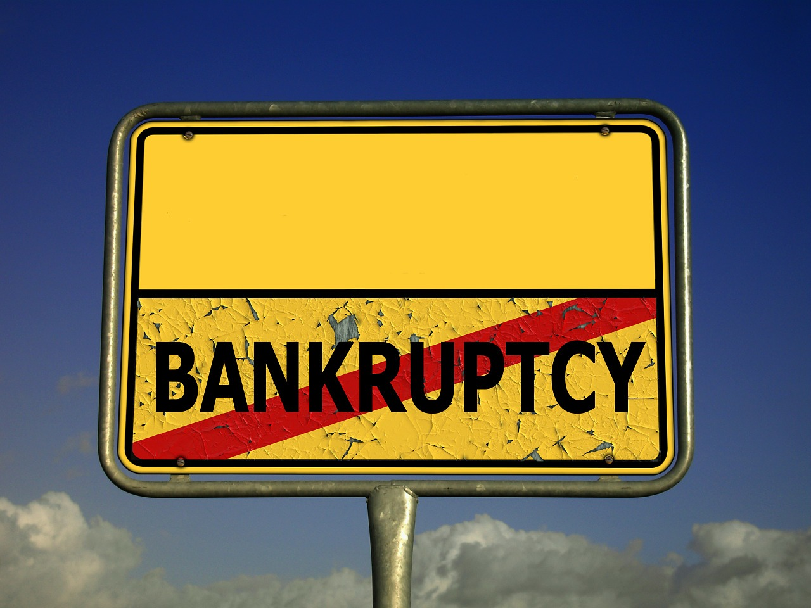

# Taiwan Companies Bankruptcy Prediction

Image by <a href="https://pixabay.com/users/geralt-9301/?utm_source=link-attribution&utm_medium=referral&utm_campaign=image&utm_content=96612">Gerd Altmann</a> from <a href="https://pixabay.com//?utm_source=link-attribution&utm_medium=referral&utm_campaign=image&utm_content=96612">Pixabay</a>

## Introduction

During financial turmoil, companies all over the world battle with the threat of either going bankrupt or otherwise. In this project, bankruptcy data of companies in Taiwan will be used to build a model to predict whether a company will go bankrupt or not. Models like this will help prevent bankruptcy in future financial crisis, thereby saving shareholders investment and the economy as a whole.

## EDA

A plot of class balance shows the distribution of bankrupt and not bankrupt companies in the the dataset. It shows that fewer companies were declared bankrupt as compared those companies that were not.

## Model

A random forest classifier, hyperparameters were built. A gridsearch  model that includes both the classifier and hyperparameter grid was then used to fit the data. Best parameters and classifier was then used to build a final model. 

## Conclusions

Based on the evaluation result of our model, we were able to predict bankruptcy with high level of accuracy. The top 10 most importing features leaading to bankruptcy were also extracted. Model like this can preven huge economic losses during financial crisis.